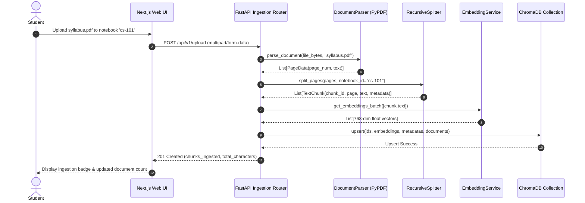
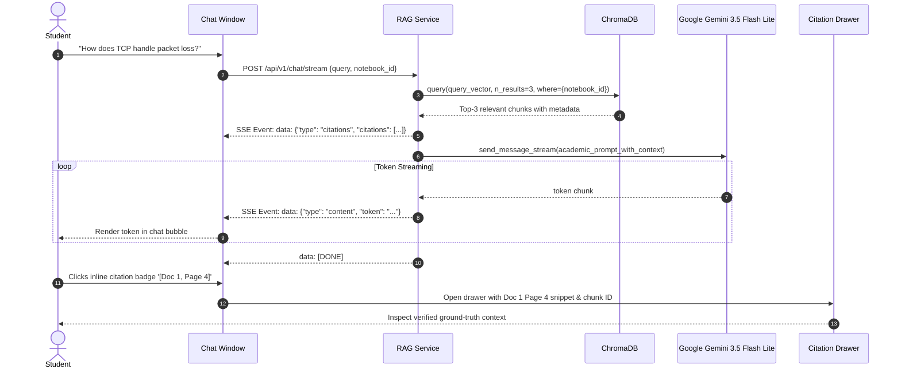

# StudySync AI — Retrieval-Augmented Generation (RAG) Academic Assistant

[](https://www.python.org/)
[](https://fastapi.tiangolo.com/)
[](https://nextjs.org/)
[](https://mui.com/)
[](https://www.trychroma.com/)
[](https://aistudio.google.com/)
[](https://www.docker.com/)

**StudySync AI** is an academic assistant and research companion designed for university students, researchers, and self-learners. Powered by Retrieval-Augmented Generation (RAG), StudySync AI indexes syllabus textbooks, lecture slides, research papers, and class notes into isolated notebooks, allowing students to query their course materials with conversational AI.

Unlike generic chatbots that hallucinate or provide unsourced answers, StudySync AI enforces **strict academic citations** (`[Doc X, Page Y]`), offers an **interactive source inspector drawer**, and includes a **full page-by-page document reader**.

---

## Key Features

- **Isolated Study Notebooks**: Organize study materials by course (e.g. `cs-101`, `bio-204`, `calculus-ii`). Documents and vector indices are strictly partitioned so queries only retrieve relevant course materials.
- **Multi-Format Ingestion**: Upload academic PDFs and TXT files. The pipeline extracts text while preserving physical page numbers.
- **Recursive Character Splitting**: Texts are divided into 500-character windows with 50-character semantic overlaps, tagged with document metadata and page numbers.
- **High-Dimensional Embeddings**: Text chunks are embedded into 768-dimensional vector spaces using Google's `gemini-embedding-001`.
- **Dual-Mode ChromaDB Engine**: Works seamlessly in Docker Compose via HTTP network orchestration, and includes an automatic local persistent client fallback (`./chroma_data`) for instant bare-metal local development.
- **Real-Time Token-by-Token SSE Streaming**: Responses stream in real time via Server-Sent Events (SSE) powered by `gemini-3.5-flash-lite`, delivering response tokens in under 2 seconds.
- **Interactive Source Citations**: Citations in responses (e.g. `[Doc 1, Page 4]`) are parsed into clickable badges that slide open a source inspector drawer showing the exact retrieved text chunk.
- **Built-in Document Reader**: View uploaded documents page-by-page directly within the UI, featuring live text search and one-click clipboard copying.
- **Zero Hallucination Guardrails**: Prompts strictly instruct the model to base answers entirely on retrieved materials and explicitly state when information cannot be found in the notebook.

---

## Architecture & System Design

### High-Level System Architecture

```mermaid
graph TD
    subgraph Frontend ["Frontend (Next.js 14 + MUI v5)"]
        UI["Study Workspace UI"]
        NM["Notebook Manager"]
        DU["Document Upload & Ingestion"]
        CW["Chat Window (SSE Consumer)"]
        CD["Citation Inspector Drawer"]
        DR["Full Document Reader Dialog"]
    end

    subgraph Backend ["Backend Service (FastAPI)"]
        API["FastAPI App Router (/api/v1)"]
        DP["Document Parser (PyPDF / TXT)"]
        TS["Text Splitter (500-char / 50 overlap)"]
        EM["Embedding Service (gemini-embedding-001)"]
        RAG["RAG Engine (Academic Prompt & Streaming)"]
    end

    subgraph VectorDB ["Vector Database"]
        CHROMA["ChromaDB (Cosine Distance / 768-dim)"]
    end

    subgraph External ["External AI APIs"]
        GEMINI["Google Gemini API (3.5-flash-lite)"]
    end

    UI --> NM
    UI --> DU
    UI --> CW
    CW --> CD
    DU --> DR
    CD --> DR

    DU -->|POST /api/v1/upload| API
    CW -->|POST /api/v1/chat/stream| API
    NM -->|GET /api/v1/notebooks| API
    DR -->|GET /api/v1/notebooks/.../documents/...| API

    API --> DP --> TS --> EM
    EM -->|Generate Embeddings| GEMINI
    EM -->|Upsert Chunks & Vectors| CHROMA

    API --> RAG
    RAG -->|Similarity Search (Top-3)| CHROMA
    RAG -->|Stream Generation (SSE)| GEMINI
    GEMINI -->|Tokens| RAG -->|text/event-stream| CW
```

---

### Ingestion Pipeline Sequence



---

### Academic Query & Citation Streaming Sequence



---

## Technology Stack

| Layer | Technology | Purpose |
|---|---|---|
| **Frontend Framework** | Next.js 14 (App Router) | High-performance React framework with server and client components |
| **UI Component System** | Material UI (MUI v5) | Cohesive theme with dark mode, typography tokens, and responsive layout |
| **Styling** | Emotion / MUI `sx` System | Type-safe styling without external CSS frameworks |
| **Icons** | `@mui/icons-material` | Material design icons |
| **Markdown Rendering** | `react-markdown` | Markdown parsing with code highlights and custom citation badge syntax |
| **Backend API** | FastAPI (Python 3.11) | High-throughput async web framework with automated OpenAPI docs |
| **Data Validation** | Pydantic v2 | Strict schema validation for requests and responses |
| **Vector Database** | ChromaDB | High-performance open-source vector store with HNSW cosine distance |
| **Document Processing** | PyPDF 4.x | PDF page extraction preserving physical page numbers |
| **AI SDK** | Google GenAI SDK (`google-genai`) | Official modern Google client for embeddings and streaming chats |
| **Embedding Model** | `gemini-embedding-001` | 768-dimensional semantic embeddings |
| **LLM Inference** | `gemini-3.5-flash-lite` | Sub-2-second conversational generation with citation attribution |
| **Containerization** | Docker & Docker Compose | Multi-container deployment for database, backend, and frontend |

---

## Repository Structure

```
StudySync AI/
├── .env.example                     # Root environment template for Docker Compose
├── .gitignore                       # Clean Git exclusion rules
├── docker-compose.yml               # Multi-service container orchestration
├── README.md                        # Primary system documentation
├── backend/
│   ├── .env.example                 # Local backend environment template
│   ├── Dockerfile                   # Python 3.11 slim container definition
│   ├── requirements.txt             # Python production dependencies
│   ├── test_health.py               # Healthcheck test suite
│   ├── test_pipeline.py             # Ingestion & embedding unit test suite
│   ├── test_endpoints.py            # REST API integration test suite
│   ├── test_stream.py               # Streaming RAG & citation test suite
│   └── app/
│       ├── main.py                  # FastAPI application entrypoint & middleware
│       ├── api/v1/
│       │   ├── health.py            # Healthcheck & ChromaDB heartbeat probe
│       │   ├── ingestion.py         # Multipart file upload & chunk indexing
│       │   ├── notebooks.py         # Notebook discovery, document reading & deletion
│       │   └── retrieval.py         # SSE streaming chat endpoint
│       ├── core/
│       │   ├── config.py            # Pydantic settings management
│       │   └── chroma.py            # Resilient dual-mode ChromaDB client
│       ├── schemas/
│       │   ├── chat.py              # Chat request, citation, and SSE models
│       │   └── document.py          # Document upload, summary, and reader models
│       └── services/
│           ├── document_parser.py   # PDF & TXT parser with page tracking
│           ├── text_splitter.py     # Recursive windowed text chunker
│           ├── embedding_service.py # Gemini embedding batch processor
│           └── rag_service.py       # Similarity retrieval & prompt synthesis
└── frontend/
    ├── Dockerfile                   # Node.js 18 alpine multi-stage build
    ├── next.config.js               # Next.js configuration
    ├── package.json                 # Node dependencies & build scripts
    ├── tsconfig.json                # TypeScript compiler configuration
    └── src/
        ├── app/
        │   ├── layout.tsx           # App root layout with theme provider
        │   └── page.tsx             # Main workspace (Tabs, Navbar, Context)
        ├── components/
        │   ├── ChatWindow.tsx       # Message thread with markdown & citation chips
        │   ├── CitationDrawer.tsx   # Slide-out ground-truth source inspector
        │   ├── DocumentReaderDialog.tsx # Full-text page-by-page document reader
        │   ├── DocumentUpload.tsx   # Drag-and-drop file upload & progress tracker
        │   └── NotebookManager.tsx  # Sidebar notebook switcher & creator
        ├── services/
        │   └── api.ts               # HTTP client & SSE streaming reader
        ├── theme/
        │   ├── theme.ts             # MUI theme palette and component overrides
        │   └── ThemeRegistry.tsx    # Next.js App Router Emotion cache registry
        └── types/
            └── index.ts             # Shared TypeScript models and interfaces
```

---

## Quickstart Guide

You can run StudySync AI using **Docker Compose** (recommended for production) or **Bare-Metal Local Development**.

### Prerequisites

- [Git](https://git-scm.com/) installed
- [Google Gemini API Key](https://aistudio.google.com/) (Free tier)
- For Docker: [Docker Desktop](https://www.docker.com/products/docker-desktop/)
- For Local: [Python 3.11+](https://www.python.org/) and [Node.js 18+](https://nodejs.org/)

---

### Option A: Running with Docker Compose (Recommended)

1. **Clone the repository**:
   ```bash
   git clone https://github.com/shoeb310/StudySync-AI.git
   cd StudySync-AI
   ```

2. **Configure environment variables**:
   ```bash
   cp .env.example .env
   ```
   Open `.env` and insert your Gemini API key:
   ```env
   GEMINI_API_KEY=your_actual_gemini_api_key
   ```

3. **Build and launch containers**:
   ```bash
   docker compose up --build
   ```

4. **Access the application**:
   - **Frontend UI**: [http://localhost:3000](http://localhost:3000)
   - **Backend API**: [http://localhost:8001/api/v1](http://localhost:8001/api/v1)
   - **Interactive API Docs (Swagger UI)**: [http://localhost:8001/docs](http://localhost:8001/docs)
   - **ChromaDB Vector Store**: [http://localhost:8000](http://localhost:8000)

---

### Option B: Local Bare-Metal Development

#### 1. Backend Setup

1. Open a terminal and navigate to `backend/`:
   ```bash
   cd backend
   ```

2. Create and activate a Python virtual environment:
   ```bash
   # Windows (PowerShell)
   python -m venv venv
   venv\Scripts\activate

   # macOS / Linux
   python3 -m venv venv
   source venv/bin/activate
   ```

3. Install backend dependencies:
   ```bash
   pip install --upgrade pip
   pip install -r requirements.txt
   ```

4. Configure your backend `.env` file:
   ```bash
   cp .env.example .env
   ```
   Add your Gemini API key inside `backend/.env`:
   ```env
   GEMINI_API_KEY=your_actual_gemini_api_key
   ```

5. Run all automated backend tests:
   ```bash
   python test_health.py
   python test_pipeline.py
   python test_endpoints.py
   python test_stream.py
   ```

6. Start the FastAPI development server:
   ```bash
   uvicorn app.main:app --reload --port 8000
   ```
   *The backend will automatically initialize a local persistent ChromaDB client at `backend/chroma_data`.*

#### 2. Frontend Setup

1. In a separate terminal, navigate to `frontend/`:
   ```bash
   cd frontend
   ```

2. Install Node dependencies:
   ```bash
   npm install
   ```

3. Build the production application to verify types:
   ```bash
   npm run build
   ```

4. Start the Next.js development server:
   ```bash
   npm run dev
   ```

5. Open your browser to [http://localhost:3000](http://localhost:3000).

---

## REST API Reference

All backend endpoints are prefixed with `/api/v1`.

### 1. Healthcheck

```http
GET /api/v1/health
```

Returns backend status, ChromaDB connection type, and Gemini API configuration state.

**Response `200 OK`**:
```json
{
  "status": "healthy",
  "project": "StudySync AI Backend",
  "environment": "development",
  "chromadb": {
    "status": "connected",
    "type": "persistent",
    "heartbeat": 1789758119391329100,
    "version": "1.5.9",
    "host": "localhost:8000"
  },
  "gemini_configured": true
}
```

---

### 2. Document Ingestion

```http
POST /api/v1/upload
Content-Type: multipart/form-data
```

Uploads a PDF or TXT document, extracts text page-by-page, splits it into 500-char chunks, computes 768-dimensional embeddings, and stores them in ChromaDB with metadata.

| Field | Type | Description |
|---|---|---|
| `file` | File | The `.pdf` or `.txt` file to ingest |
| `notebook_id` | String | Target course/notebook identifier (e.g. `cs-101`) |

**Response `201 Created`**:
```json
{
  "status": "success",
  "notebook_id": "cs-101",
  "filename": "operating_systems_summary.txt",
  "chunks_ingested": 5,
  "total_characters": 1280
}
```

---

### 3. Notebook Management

#### List Active Notebooks
```http
GET /api/v1/notebooks
```

Scans all indexed vectors and groups document counts and unique filenames by notebook ID.

**Response `200 OK`**:
```json
{
  "notebooks": [
    {
      "notebook_id": "cs-101",
      "document_count": 2,
      "chunk_count": 18,
      "documents": ["cpu_scheduling.pdf", "virtual_memory.txt"]
    }
  ]
}
```

#### Delete Notebook Documents
```http
DELETE /api/v1/documents/{notebook_id}
```

Purges all indexed vectors and documents for the specified notebook.

**Response `200 OK`**:
```json
{
  "status": "success",
  "notebook_id": "cs-101",
  "message": "Successfully purged 18 chunks for notebook 'cs-101'.",
  "deleted_chunks": 18
}
```

---

### 4. Full Document Reading

```http
GET /api/v1/notebooks/{notebook_id}/documents/{filename}
```

Reconstructs all indexed text chunks for an uploaded document, grouped and ordered by physical page number.

**Response `200 OK`**:
```json
{
  "notebook_id": "cs-101",
  "filename": "cpu_scheduling.pdf",
  "total_chunks": 12,
  "total_pages": 3,
  "chunks": [
    {
      "chunk_id": "cs-101_cpu_scheduling.pdf_p1_c0",
      "page_number": 1,
      "text": "Chapter 5: CPU Scheduling. Basic Concepts..."
    }
  ]
}
```

---

### 5. Academic Streaming RAG

```http
POST /api/v1/chat/stream
Content-Type: application/json
```

Retrieves top-3 relevant context chunks using vector similarity, constructs an academic prompt with strict citation instructions, and streams the answer token-by-token over Server-Sent Events (SSE).

**Request Body**:
```json
{
  "query": "How does round robin CPU scheduling work?",
  "notebook_id": "cs-101"
}
```

**Response Stream (`text/event-stream`)**:
```
data: {"type": "citations", "citations": [{"doc_id": 1, "chunk_id": "cs-101_cpu_scheduling.pdf_p1_c0", "filename": "cpu_scheduling.pdf", "page_number": 1, "snippet": "..."}]}

data: {"type": "content", "token": "Round "}

data: {"type": "content", "token": "robin "}

data: {"type": "content", "token": "allocates a fixed time quantum [Doc 1, Page 1]."}

data: [DONE]
```

---

## User Interface & Experience

1. **Notebook Management Sidebar**:
   - Create new notebooks with instant client-side validation.
   - Switch between courses with automatic context filtering.
   - Clear notebook contents with safety confirmations.
2. **Knowledge Ingestion Area**:
   - Drag-and-drop zone for `.pdf` and `.txt` files.
   - Real-time percentage progress bar tracking upload, chunking, and embedding creation.
   - List of all indexed documents in the active notebook with document read shortcuts.
3. **Academic Chat Window**:
   - Formatted question and answer thread with GitHub-flavored markdown.
   - Interactive citation tags: `[Doc 1, Page 4]` automatically renders as a clickable Chip.
   - Real-time animated typing cursor and auto-scrolling.
   - Pre-configured starter prompts for rapid exploration.
4. **Source Citation Inspector**:
   - Slide-out drawer displaying retrieved document name, page number, and chunk ID.
   - Exact ground-truth quotation card for academic verification.
   - Multi-source selector tabs when an answer draws from several documents.
   - Direct button to read the full source document.
5. **Full Document Reader**:
   - Modal reading interface presenting reconstructed page-by-page text.
   - Real-time keyword filter to search inside long lecture notes.
   - Page navigation tabs (`All Pages`, `Page 1`, `Page 2`, ...).
   - One-click button to copy document text to the clipboard.

---

## Verification & Testing Suite

StudySync AI includes comprehensive test suites across every layer:

```bash
# Navigate to backend
cd backend
venv\Scripts\activate

# 1. Test healthcheck & ChromaDB heartbeat probe
python test_health.py

# 2. Test PDF/TXT parsing, chunking, and Gemini embeddings
python test_pipeline.py

# 3. Test REST API upload, notebook discovery, document reader & deletion
python test_endpoints.py

# 4. Test RAG similarity retrieval, academic prompt synthesis & SSE streaming
python test_stream.py
```

To verify frontend TypeScript compilation and production builds:

```bash
cd frontend
npm run build
```

---

## License

This project is open-source and available under the [MIT License](LICENSE).
